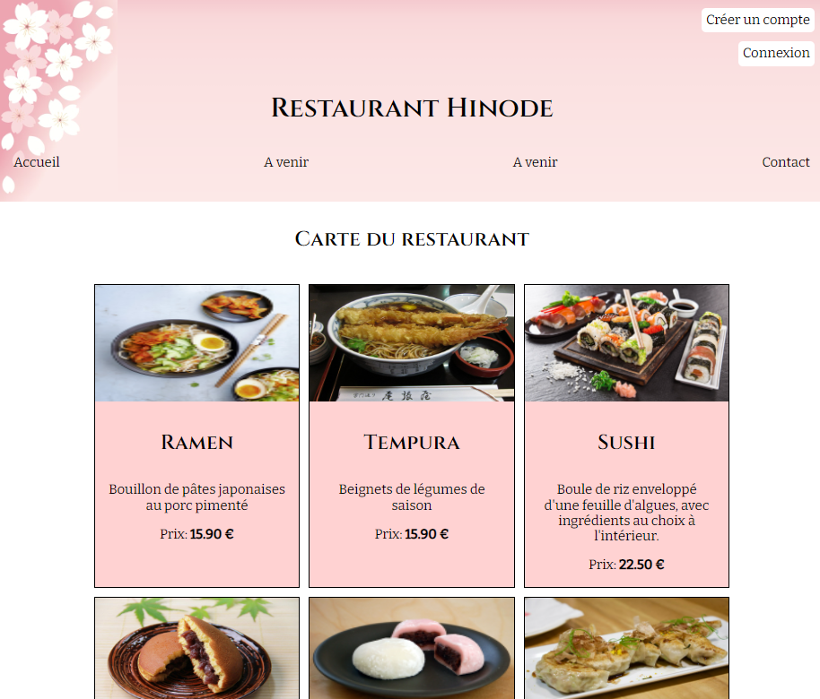

<h1 align="center">Hello 👋, I'm Anaelle</h1>
<h3 align="center">A developer fullstack near to Marseille</h3>

- 💼 I’m looking for an apprenticeship or a job where I can strengthen my skills

- 💻 I’m currently working on **a project of an online library**

<h1 align="center">My first projects</h1>

  <table>
        <tr>
            <td width="50%">
                <h3 align="center">📖 Library online</h3>
                

                    
                    

                        This is my graduation project, an online library coded in HTML, CSS, JS, PHP and MySQL.
                    

            

            </td>
            <td width="50%">
                <h3 align="center">🍙 Restaurant-coming soon</h3>
                

                    
                    

                        A restaurant project to order a delicious meal !
                    

            

            </td>
        </tr>
        <tr>
            <td width="50%">
                <h3 align="center">🛒 Shopping list</h3>
                

                    
                    

                        A shopping list to remember your long list...
                    

                

            </td>
            <td width="50%">
                <h3 align="center"></h3>
                

                    
   
                    

                

            </td>
        </tr>
  </table>

<h1 align="center">Languages and Tools</h1>

<h3 align="center">Front</h3>

    
    
  
  
  

<h3 align="center">Backend</h3>

    
   

  

  
